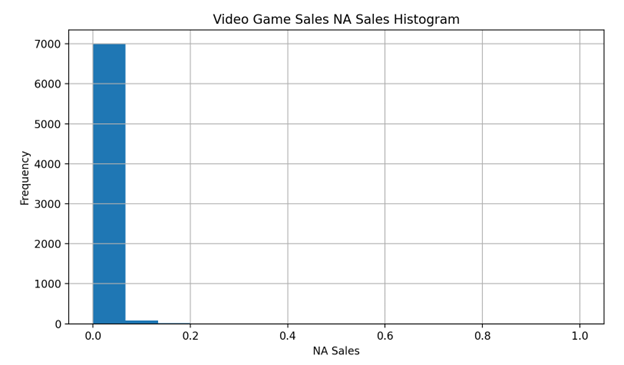
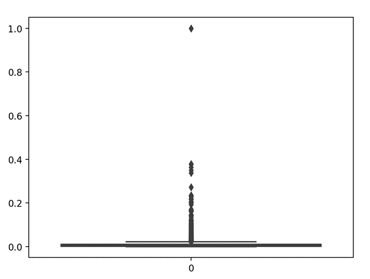
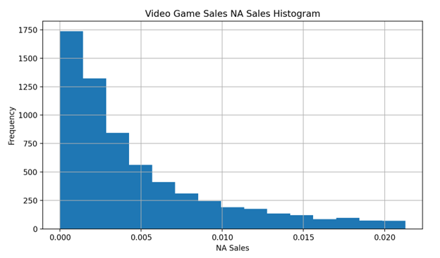
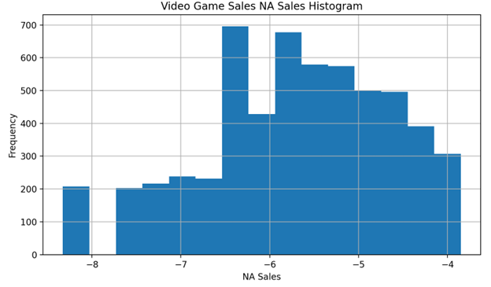
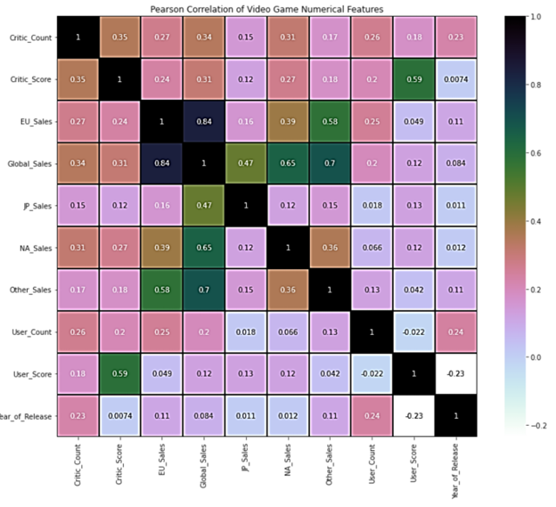

# LinearRegressionOnVideoGameSales

## Abstract

In recent years, the video game industry had rapidly expanded.
Unfortunately, not all video game publishes grant game developers
enough revenue in comparison to the efforts they made. This 
situation leaves developers wonder what kind of game elements 
could result in higher game sales. The goal of the model presented 
in this paper is to perform linear regression on predicting video 
game sales in North America. The model could hint correlation 
between model features and sales in North America. The paper 
used linear regression model from sklearn to train and 
predict North America sales.

## Introduction

Starting on 2015, the video game industry had rapidly expanded. 
In 2021, there are 10,394 games published on Steam, one of the 
biggest online game stores [1]. In comparison, there are only 1,582 
games published on Stream during 2015. The increase publishes of 
video game significantly impel the expansion of the video game 
industry. Unfortunately, not all video game publishes grant game 
developers enough revenue in comparison to the efforts they made. 
In fact, 50% of indie games published on Steam never made more 
than $4,000 [2]. Therefore, game developers are longing for a 
model that can finding the features that have positive impact on 
video game revenue. In this paper, linear regression model is 
performed to predict a game’s revenue within the North America 
region.

## Data Pre-processing
The dataset is called, Video Game Sales and Ratings, from Kaggle
[3]. The dataset contains 17,416 rows and there are 15 columns: 
Name, Platform, Year of Release, Genre, Publisher, Sales from 
North America, Europe, Japan, and other regions, Global Sales, 
Critic Score, Number of Critic Score used, User Score, Number of 
User Score, and Rating

### Remove Missing Values

The dataset contains 10304 missing values within the Critic Score, 
Number of Critic Count, User Score, Number of User Score, and 
Rating. Therefore, rows within the dataset that contains missing is 
removed from the dataset, which will remain 7,112 rows.

The histogram below shows the normalized distribution of the sales 
from North America within 15 bins.

**Figure 1: Video Game North America Sales Histogram**

### Detect and Remove Outlier

The tables shows that most of the game published have never make 
more than $10,000,000. Furthermore, some outstanding data have 
been revealed based on the histogram. For instance, Wii Sports had 
made around 40 million dollars until 2017, which differs by a 
substantial amount from the majority of game that have never made 
above 10 million dollars. One of the ways to detect outliers is 
boxplot, it can be used to find data that falls above boxplot 
lower/upper whisker. 

$IQR = Q3 - Q1$

$Lower Whisker = 𝑄1 − 1.5 * IQR$

$Upper Whisker = 𝑄3 + 1.5 * IQR$

Below is the boxplot about the North America sales:
Video Game Salse Machine Learning Prediction, 12 December
2022, Bothell, Washington USA

**Figure 2: Video Game North America Sales Boxplot**

The boxplot shows that sales within the North America region are 
greatly skewed towards 0 million. This method detects and removes 
724 outliers, which will result in 6388 rows. This means that around 
10% of the dataset that do not have missing values are outliers 
because they do not fall within the lower/upper whisker. Below is 
the histogram based on the filtered dataset:

**Figure 3: Video Game North America Sales Histogram Without Outlier**

The filtered histogram shows a smoothed curve in comparison to 
the straight edge with outliers. This histogram also shows that 
majority of video game sales within the North America region falls 
between 0 to 1 million dollars. To visualize the data as normal 
distribution, log transformation is used. The histogram below 
shows the North America sales in normal distribution:

**Figure 4: Histogram about the Log Transformation of North America Sales**

The histogram above shows an approximately bell shape normal 
distribution of the North America data after performing log 
transformation. 

### Pick Impactful Features

#### Feature Correlations

To ensure that the independent variables don’t suffer from 
autocorrelation, which could be problematic to regression model. 
Let’s analyze the correlation heatmap about the numeric variables 
in the filtered dataset.

**Figure 5: Pearson Correlation Heatmap of Video Games Numerical Features**

Based on the correlation heatmap, the independent variables aren’t 
highly correlated with each other. Overall, the sales regions tend to 
have higher correlation with other sales regions. This explained an 
situation where high sales in a specific region tend to speak for sales 
success in other regions.

#### Feature Engineering

To include categorical variables into regression model, dummy 
variables are used to transform “Platform”, “Genre”, and “Rating” 
columns. This result in a total of 43 columns of the filtered dataset. 
However, there is a consequence from using dummy variables, 
which is multicollinearity. This means that one variable can be 
predicted from other variables and makes it difficult to interpret the 
coefficient of the dummy variables on the prediction model. This 
multicollinearity resulting in loss of accuracy of the model.

Before going into feature selection, the columns “Name”, 
“Publisher”, “Global_Sales” are removed from the dataset. The 
reason why the model should remove “Name” and “Publisher”
from the dataset is because adding dummy variables for each 
distinct name is not reasonable and not in the interest of the 
prediction. In terms of why “Global_Sales” column is removed 
from the dataset is because the value inside the column 
“Global_Sales” are the sum of values from “NA_Sales”, 
“EU_Sales”, “JP_Sales”, and “Other_Sales”. The prediction 
coefficient situation of 𝑁𝐴 = −𝐸𝑈 − 𝐽𝑃 − 𝑂𝑡ℎ𝑒𝑟 + 𝐺𝑙𝑜𝑏𝑎𝑙
is undesirable. After removing 3 features, the dataset resulted in 40 
features in total.

#### Feature Selection

To find the impactful features within the dataset, recursive feature 
elimination (RFE) is used. Recursive Feature Elimination is a 
wrapper-type feature selection algorithm, which search for a subset 
of the features by starting will all features into the model and 
remove features until a subset of features achieving the desiring 
score.

After performing RFE on the dataset, 26 features were selected: 
Critic_Count, Critic_Score, EU_Sales, Genre_Adventure, 
Genre_Puzzle, Genre_Racing, Genre_Role-Playing, 
Genre_Strategy, JP_Sales, Other_Sales, Platform_DC, 
Platform_DS, Platform_PC, Platform_PS2, Platform_PS4, 
Platform_PSP, Platform_PSV, Platform_Wii, Platform_X, 
Platform_X360, Rating_K-A, Rating_M, Rating_T, User_Count, 
User_Score, and Year_of_Release.

## Linear Regression

Using the 26 features to predict video game sales in North 
America resulted in 26 coefficients and 1 intercept. The predictor 
coefficients are as follows:

|Feature Name | Coefficient (Round to 3 digits) |
|-------------|---------------------------------|
|Critic_Count |1.230|
|Critic_Score |1.362|
|EU_Sales |18.553|
|Genre_Adventure |-0.370|
|Genre_Puzzle |-0.539|
|Genre_Racing |-0.208|
|Genre_Role-Playing |-0.212|
|Genre_Strategy |-0.402|
|JP_Sales |1.006|
|Other_sales |23.553|
|Platform_DC |-0.001|
|Platform_DS |0.065|
|Platform_PC |-1.641|
|Platform_PS2 |-0.203|
|Platform_PS4 |-0.705|
|Platform_PSP |-0.212|
|Platform_PSV |-0.653|
|Platform_Wii |0.316|
|Platform_X |-0.211|
|Platform_X360 |0.145|
|Rating_K-A |-0.231|
|Rating_M |-0.160|
|Rating_T |-0.131|
|User_count |2.642|
|User_score |-0.371|
|Year_of_Release |-0.498|
|(intercept) |-6.187|

**Table 1: Video Game Sales Linear Regression Coefficients and Intercept**

Based on the coefficients, features such as Critic_Count, 
Critic_Score, EU_Sales, JP_sales, Platform_DS, Platform_Wii, 
Platform_X360, and User_count have positive coefficients. This 
means that the higher the value it is for these features, the higher 
the video game sale in North America region.

By computing validation with testing data, the model produce the 
following statistics:

|Statistic |Value|
|----------|-----|
|Training Accuracy  |0.3808884638705907|
|Testing Accuracy |0.3688533080194625|
|Mean Absolute Error |0.64|
|Mean Square Error |0.68|
|$𝑹^𝟐$ Score |0.37|

**Table 2: Video Game Sales Linear Regression Model Statistic**

Based on the table above, there are three statistics shown. Mean 
Absolute Error (MAE) is the measure of the absolute average 
distance between the real data and the predicted data. Mean Square
Error (MSE) is the measure of squared average distance between 
the real data and the predicted data. $𝑅^2$ score is a model fit measure 
that indicates how much the variation of the dependent variable is 
explained by the independent variables in the regression model.

The MAE statistic is used when there are many outliers because it 
is less sensitive to outlier than MSE and it is easier to interpret than 
MSE. Based on the statistic result, the MAE and MSE is very 
similar with a 0.04 difference, and both are close to 0. This means 
the average absolute/squared distance between the real data and 
predicted data is around 0.65.

On the other hand, $𝑅^2$
score of 0.37 means that the linear regression 
model only explained 37% of the variation of North America Sales 
using the 26 features. Since the highest $𝑅^2$
score is 1 and $𝑅^2$ score 
could be negative, this shows that linear regression positively 
follows the trend of the testing data, but the score of 0.37 is far from 
perfectly predict the testing data. 

## Result

Based on the mean absolute error and mean squared 
error, linear regression have 
the mean absolute error around 0.64 MAE and 0.68 MSE. 
In terms of $𝑅^2$
score, linear regression model score 0.37.

The statistics shows that linear regression, although 
it might shows some relationship betweens denpendent variable
and the predictor variables, it is not sufficient enough to 
correctly predict a video game's sale in the North America region

## Sources

[1] Clement, J. (2022, September 5). Steam annual game releases 2022. Statista. 
Retrieved November 8, 2022, from 
https://www.statista.com/statistics/552623/number-games-released-steam/

[2] Games industry data and analysis. Video Game Insights. (2020, April 9). 
Retrieve November 8, 2022, from https://vginsights.com/insights/article/infographic-indie-game-revenues-on-steam

[3] KendallGillies. (2017, January 25). Video game sales and ratings. Kaggle. 
Retrieved November 8, 2022, from 
https://www.kaggle.com/datasets/kendallgillies/video-game-sales-and-rating?datasetId=722
